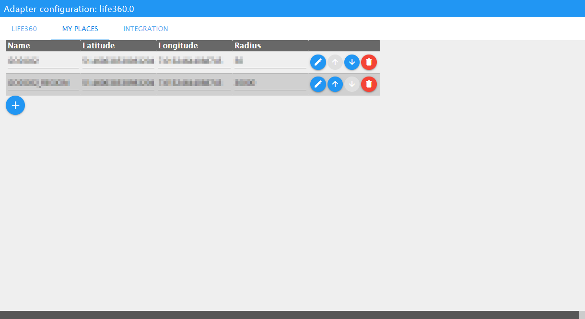
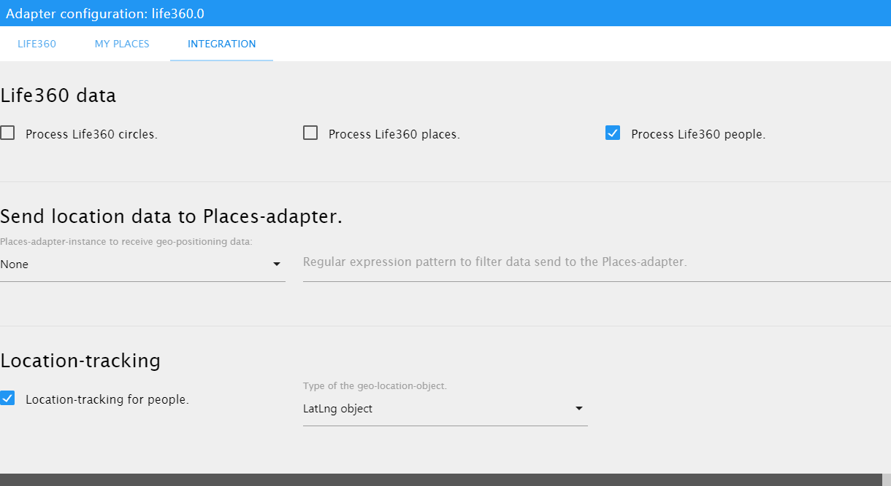

# ioBroker.life360


[](https://www.npmjs.com/package/iobroker.life360)
[](https://www.npmjs.com/package/iobroker.life360)


[](https://david-dm.org/MiGoller/iobroker.life360)
[](https://snyk.io/test/github/MiGoller/ioBroker.life360)

[](https://nodei.co/npm/iobroker.life360/)

**Tests:** 

## Life360 adapter for ioBroker

An ioBroker adapter for [Life360](https://www.life360.com).

## Description

This adapter connects to the [Life360](https://www.life360.com) cloud services to allow you to track people and to detect their presence at defined places. It retrieves information about the user's circles, the circles' members and the circles' places. These information persists the adapter in ioBroker states. Any states will get updated in a given interval.

## Installation

Right now you'll have to add the adapter to your ioBroker using a custom URL pointing to the corresponding [GitHub](https://github.com/) repository at https://github.com/MiGoller/ioBroker.life360/tree/master .

### Install the Node JS package on the command line

If you don't want to install the adapter using the web UI or if you want to install a special version, including development version, you can do so on the command line.

1. Login to your ioBroker host
2. Switch to ioBroker's installation directory (defaults to `/opt/iobroker`)
3. Run the following commands

    ``` bash
    iobroker npm install migoller/iobroker.life360 --loglevel error --prefix "/opt/iobroker"
    ```

4. Add an instance using the web UI

If you want to install the development version just type ...

``` bash
iobroker npm install migoller/iobroker.life360#develop --loglevel error --prefix "/opt/iobroker"
```

## Configuration

### Life360 cloud services

You'll have to setup the adapter with your personal [Life360](https://www.life360.com) credentials to let the adapter poll the information from the cloud services. You can login with your mobile phone number or your email-address (recommended) for Life360, but in any case you'll have to set the password to your personal Life360 password.


- Either enter your email address **OR** your country code and mobile phone number. **Do NOT enter email address and mobile phone information !**

- Feel free to modify the default timespan of 60 seconds for the polling interval. The polling interval must be 15 seconds or more.

### My Places

You can add your own places apart from the Life360 places to your adapter instance. "My Places" let you define private places that are not public to the Life360 cloud services. The adapter checks which persons are present at your private places on every Life360 data poll.



The places' setup happens the same way as with the Places-adapter:

- Define a ```Name``` for the place.

- Set the geo-position data for the place (latitude and longitude).

- Set the place's radius in meters.

#### Why should I use My Places apart from Life360 places?

- My Places are private! Life360 will not know about them.

- People can be present at more than one place at the same point of time. For example you can be present at your "home" place and your "neighborhood" place at the same time.

- You can set the place's radius without any limitations (minimum value).

### Integration

The Life360 cloud services provide a lot of information about the circles, places and people. You have the freedom of choice. You device which data will be available to your ioBroker installation.



#### Life360 data

Select the Life360 data you want the adapter to push to ioBroker data points.

- Enable processing of ```Life360 circles``` for information regarding the circles, the circles' places and the circles' members. You will get a lot of information regarding the circles, but only essential information about places and people.

- Enable processing of ```Life360 places``` for detailed information regarding any Life360 circle, you are a member of.

- Enable processing of ```Life360 people``` for detailed information about any Life360 person, who are members of the circles you are a member of.

#### Send location data to Places-adapter

The ioBroker.life360 adapter let you send location data for known Life360 people to an instance of the Places-adapter.

- Select an instance of the Places-adapter as a receiver for the location data. Select ```None``` to disable sending of location data.

- You can include or exclude people using regular expression patterns. The adapter will check if the string ```[Firstname] [Lastname]``` matches your pattern. Set pattern to empty string to disable regex filtering.

#### Location-Tracking

You can activate location-tracking for all people. Location-tracking will add geo-positioning details to the people information.

- Check to activate location-tracking.

- Set the geo-location object-type to push combined latitude and longitude values.

## Disclaimer

I did not find any official documentation for the [Life360](https://www.life360.com) REST APIs. Apparently [Life360](https://www.life360.com) does not support the use of the REST API for other applications than its own ones.

My REST API integration is based on reverse engineering done by the open source community and an API token discovered on [Life360](https://www.life360.com) code which is public available. [Life360](https://www.life360.com) could disable or modify this API token or change its REST API in a way that this adapter will not work as expected anymore.

Feel free to modify the default timespan of 60 seconds for the polling interval. The adapter does not allow modifying the interval to less than 15 seconds to prevent gaining any rate limits and to prevent ioBroker Admin getting slower and slower.

## Changelog

### 0.2.19 (2022-11-09)
* (MiGoller) Fix for issue #64: Adapter v.0.2.18 fails to login

### 0.2.18 (2022-06-10)
* (MiGoller) Fix for issue #59: Adapter fails to authenticate after Life360 API changed.

### 0.2.17 (2021-11-21)

* (PeterVoronov) Fix for issue [#41: Fix for error in publishCirclePlaces "Cannot read property 'val' of null](https://github.com/MiGoller/ioBroker.life360/pull/41)
* (MiGoller) Fix for issue [#44: V 0.2.16 warnung no places found](https://github.com/MiGoller/ioBroker.life360/issues/44)
* (MiGoller) Fix for issue [#47: Keine Sonderzeichen möglich](https://github.com/MiGoller/ioBroker.life360/issues/47)


### 0.2.16 (2021-07-12)

- (MiGoller) Fix for issue #39: Don't let the adapter crash if the Life360 API returns a server error.
- (MiGoller) Fix for issue #35: ioBroker complains about writing to a read-only state on adapter startup.

### 0.2.15 (2021-05-07)

- (MiGoller) Fix for issue #25: Sanitize strings for ioBroker object IDs
- (MiGoller) Fix for issue #21: Adjust object type for gps-coordinates
- (MiGoller) Enhancement issue #32: Add a new format for gps-coordinates for easier integration in Jarvis
- (MiGoller) Enhancement issue #29: Think about to fix the issues found by adapter checker

### 0.2.14

- (MiGoller) Fix for issue #27: Adapter looses places (connection)
- (MiGoller) Enhanced code to prevent warnings on setting state value for new objects / datapoints.

### 0.2.13

- (PeterVoronov) Pull request #24: Allow to create states with "write": false, to make value.gps.* compatible with ioBroker.type-detector.

### 0.2.12

- (MiGoller) Bug fix for issue #22: MyPlaces feature does not show all members

### 0.2.11

- (MiGoller) Added verbose logging on demand

### 0.2.10

- (MiGoller) Fix for Issue #18: Error TypeError: Cannot read property 'sourceId' of null since update to 0.2.8

### 0.2.9

- (MiGoller) Removed node v8 from Travis config to fix build process.

### 0.2.8

- (MiGoller) Upgraded several packages to wanted versions.

### 0.2.7

- (MiGoller) Upgraded lodash from 4.17.15 to 4.17.19

### 0.2.6

- (MiGoller) Bugfix for issue #12: Uncaught exception: Cannot read property 'timestamp' of null

### 0.2.5

- (MiGoller) Bug fix for issue #9: check Adapter with js-controller 3.0.x.
- (MiGoller) Updated packages and dependencies.

### 0.2.4

- (MiGoller) Clean up stale datapoints after 30 days to prevent removing datapoints when Life360 is not available.

### 0.2.3

- (MiGoller) Added simple integrity checks for Life360 data.

### 0.2.2

- (MiGoller) The adapter will remove stale datapoints.

### 0.2.1

- (MiGoller) MyPlaces: Add additional places apart from the Life360 ones.

### 0.1.1

- (MiGoller) First alpha release

### 0.0.1

- (MiGoller) initial release

## License

MIT License

Copyright (c) 2019-2021 Michael Goller <goller.michael@gmail.com>

Permission is hereby granted, free of charge, to any person obtaining a copy
of this software and associated documentation files (the "Software"), to deal
in the Software without restriction, including without limitation the rights
to use, copy, modify, merge, publish, distribute, sublicense, and/or sell
copies of the Software, and to permit persons to whom the Software is
furnished to do so, subject to the following conditions:

The above copyright notice and this permission notice shall be included in all
copies or substantial portions of the Software.

THE SOFTWARE IS PROVIDED "AS IS", WITHOUT WARRANTY OF ANY KIND, EXPRESS OR
IMPLIED, INCLUDING BUT NOT LIMITED TO THE WARRANTIES OF MERCHANTABILITY,
FITNESS FOR A PARTICULAR PURPOSE AND NONINFRINGEMENT. IN NO EVENT SHALL THE
AUTHORS OR COPYRIGHT HOLDERS BE LIABLE FOR ANY CLAIM, DAMAGES OR OTHER
LIABILITY, WHETHER IN AN ACTION OF CONTRACT, TORT OR OTHERWISE, ARISING FROM,
OUT OF OR IN CONNECTION WITH THE SOFTWARE OR THE USE OR OTHER DEALINGS IN THE
SOFTWARE.
